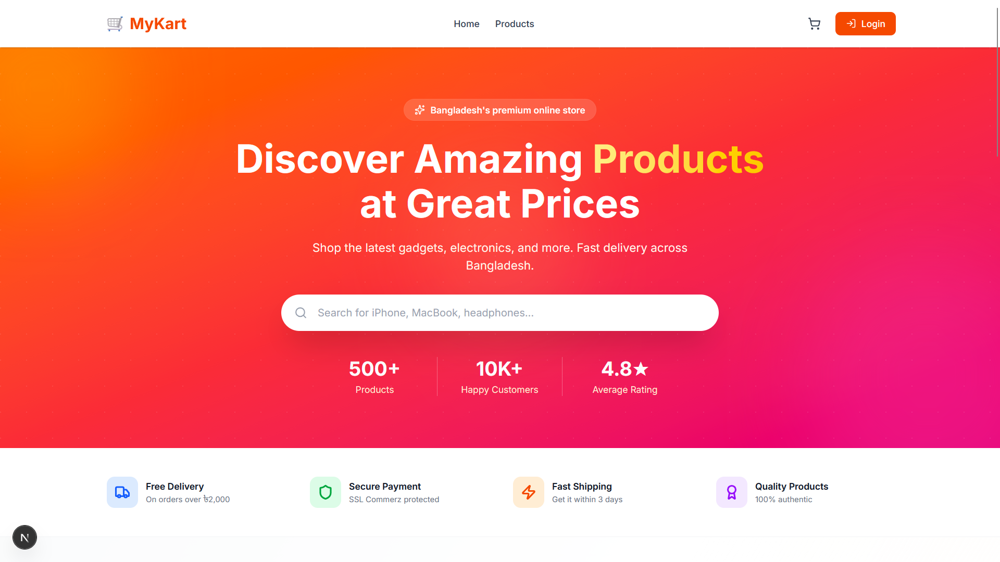
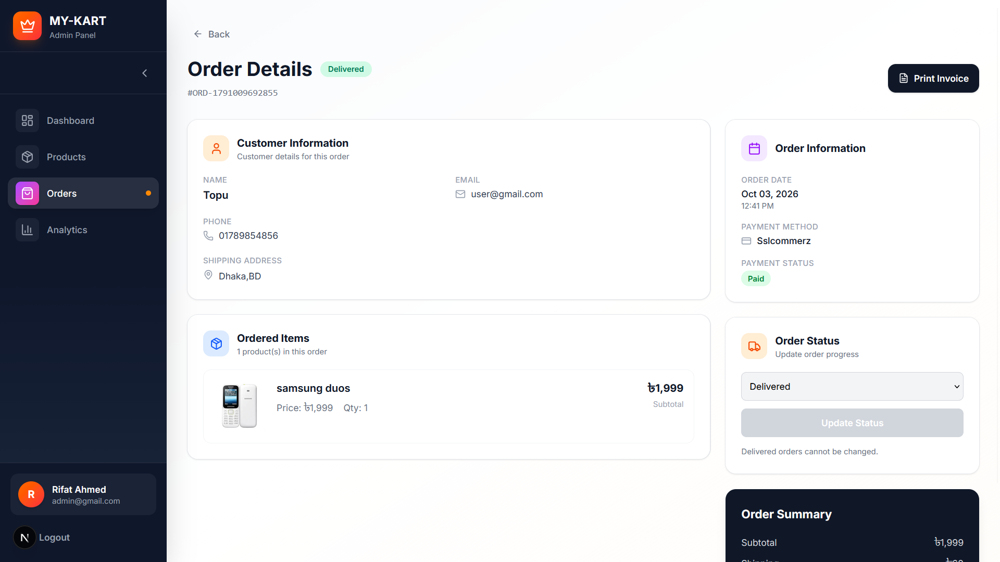
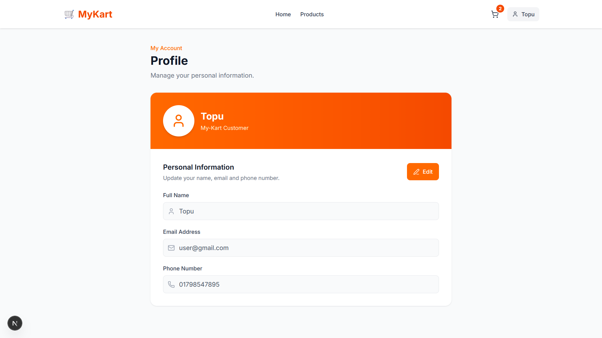

# 🛒 My-Kart

<p align="center">
  
  
  
</p>

<p align="center">
  A modern full-stack e-commerce platform built with Next.js, NestJS, PostgreSQL, JWT authentication, real-time communication, online payment integration, cloud image storage, email services, and an admin dashboard.
</p>

<p align="center">
  <strong>At a glance:</strong> customer and admin roles · cart and checkout · SSLCommerz payment (sandbox) with server-side validation · controlled order workflow · real-time ratings (Socket.IO) · admin analytics and invoices. Not deployed yet; run it locally using the steps in the Installation section.
</p>

<p align="center">
  <a href="#-features">Features</a> •
  <a href="#-screenshots">Screenshots</a> •
  <a href="#-tech-stack">Tech Stack</a> •
  <a href="#-architecture">Architecture</a> •
  <a href="#-installation">Installation</a>
</p>

---

## 🎥 Project Demo

▶️ **[Watch the My-Kart Project Demo](YOUR_GOOGLE_DRIVE_LINK)**

A short walkthrough of the main customer and admin workflows, including authentication, product browsing, cart, checkout, orders, ratings, real-time updates, and administration.

---

## 🛍️ About

**My-Kart** is a full-stack e-commerce application designed to simulate a real-world online shopping platform.

```text
👤 Authentication
      ↓
🛍️ Product Browsing
      ↓
🛒 Cart
      ↓
📦 Checkout
      ↓
💳 Payment
      ↓
📋 Orders
      ↓
⭐ Ratings
```

The project focuses on practical full-stack concepts including authentication, authorization, business-rule validation, payment verification, real-time communication, cloud services, and admin management.

---

## ✨ Features

### 👤 Customer

* 📝 Registration & Login
* 🔐 JWT authentication
* 👤 Profile management
* 🔑 Forgot & Reset Password
* 🛍️ Product browsing & details
* 🔎 Product search
* 🛒 Persistent shopping cart
* ➕ Quantity management
* 💰 Subtotal & shipping calculation
* 📦 Checkout
* 💵 Cash on Delivery
* 💳 SSLCommerz online payment
* 📋 Order history & details
* ❌ Eligible order cancellation
* ⭐ Purchased-user-only ratings
* ✏️ Rating updates
* ⚡ Real-time rating updates

### 👨‍💼 Admin

* 📊 Dashboard
* 📈 Order & revenue analytics
* 🛍️ Product management
* 📦 Order management
* 🔄 Controlled order status workflow
* 💳 Payment status monitoring
* 🧾 Invoice generation
* 🔐 Admin-only protected routes
* 📱 Responsive admin interface

---

## 📸 Screenshots

### 🏠 Home Page



Responsive product browsing with categories, pricing, ratings, and shopping actions.

### 🛍️ Product Details


Product information, images, price, availability, ratings, and cart interaction.

### 🛒 Shopping Cart


Persistent cart with quantity controls, subtotal, shipping, total, and checkout action.

### 💳 Checkout


Shipping information and payment options including Cash on Delivery and SSLCommerz.

### 📦 Customer Orders


Customer order history with order status and payment information.

### 🔍 Order Details



Detailed order information including products, shipping, payment method, total, and status.

### 👤 Profile



Authenticated user profile with editable account information.

### 🔐 Authentication


Registration and login interface with JWT-based authentication.

### 📊 Admin Dashboard


Store overview including orders, payment status, cancellations, and revenue.

### 📦 Admin Products


Product catalog management for administrators.

### 🛍️ Admin Orders


Admin order management with controlled status transitions.

### 📈 Admin Analytics


Order, revenue, and status analytics using Recharts.

### 🧾 Order Invoice


Printable/downloadable order invoice containing customer, product, payment, and order information.

---

## 🧰 Tech Stack

### Frontend

| Technology       | Purpose                 |
| ---------------- | ----------------------- |
| Next.js          | React framework         |
| React            | UI development          |
| TypeScript       | Type safety             |
| Tailwind CSS     | Styling & responsive UI |
| Axios            | API communication       |
| Context API      | Global state            |
| Socket.IO Client | Real-time updates       |
| Recharts         | Admin analytics         |
| React Hot Toast  | Notifications           |
| Lucide React     | Icons                   |

### Backend

| Technology      | Purpose                 |
| --------------- | ----------------------- |
| NestJS          | Backend framework       |
| TypeScript      | Type safety             |
| TypeORM         | ORM                     |
| PostgreSQL      | Relational database     |
| JWT             | Authentication          |
| Passport        | Auth strategy           |
| bcrypt          | Password hashing        |
| class-validator | DTO validation          |
| Socket.IO       | Real-time communication |

### External Services

* ☁️ **Cloudinary** — Product image storage
* 💳 **SSLCommerz** — Online payment
* 📧 **Resend** — Password reset emails
* 🐘 **Neon PostgreSQL** — Planned production database

---

## 🏗️ Architecture

### Development

```text
Next.js Frontend
       ↓
  NestJS REST API
       ↓
PostgreSQL Database
       ↘
   Cloudinary
       ↘
  SSLCommerz
       ↘
    Resend
```

### Planned Production

```text
Users
  ↓
Vercel
(Next.js)
  ↓
Render
(NestJS)
  ↓
Neon PostgreSQL
  ↘
Cloudinary

External:
SSLCommerz
Resend
Socket.IO
```

---

## 🔐 Authentication & Security

My-Kart uses JWT-based authentication with role-based authorization.

### Roles

```text
CUSTOMER
ADMIN
```

Implemented security features:

* JWT authentication
* Protected backend routes
* Role-based authorization
* bcrypt password hashing
* DTO validation
* Secure password reset tokens
* SHA-256 reset-token hashing
* 15-minute reset-token expiration
* Server-side business-rule validation
* Server-side payment verification
* Database-level rating uniqueness

---

## 🔑 Password Reset

```text
Forgot Password
      ↓
Secure Random Token
      ↓
SHA-256 Hash
      ↓
15-Minute Expiration
      ↓
Resend Email
      ↓
Reset Password
      ↓
bcrypt Hash
```

The password reset workflow is fully implemented.

**Current limitation:** Resend is currently configured with a testing sender. Production email delivery requires a verified sending domain.

---

## 💳 Payment System

### Cash on Delivery

Customers can place an order without online payment and pay when the product is delivered.

```text
Checkout
   ↓
Cash on Delivery
   ↓
Order Created
   ↓
Admin Processing
   ↓
Delivery
   ↓
Customer Payment
```

### SSLCommerz

Online payments are handled through SSLCommerz sandbox integration.

```text
Checkout
   ↓
Create Order
   ↓
SSLCommerz
   ↓
Payment
   ↓
Backend Validation
   ↓
Order → PAID
   ↓
Cart Cleared
```

Payment status is validated by the backend before marking an order as paid.

---

## 📦 Order Management

Orders follow a controlled server-side workflow:

```text
PENDING
   ↓
PAID
   ↓
PROCESSING
   ↓
SHIPPED
   ↓
DELIVERED
```

Eligible orders can be cancelled from the appropriate states.

Invalid status transitions are rejected by the backend.

---

## ⭐ Rating System

The rating system follows e-commerce business rules:

* User must be authenticated
* User must have purchased the product
* Cancelled orders do not qualify
* One rating per user/product
* Existing ratings can be updated
* Rating range: 1–5
* Average rating is calculated dynamically

A database unique constraint prevents duplicate ratings:

```ts
@Unique(['userId', 'productId'])
```

### ⚡ Real-Time Ratings

Socket.IO broadcasts rating updates to connected clients:

```text
User submits rating
       ↓
NestJS Backend
       ↓
PostgreSQL
       ↓
Socket.IO Event
       ↓
Connected Clients
       ↓
Updated Rating
```

---

## 🧾 Admin Invoice

Administrators can generate a printable/downloadable invoice containing:

* Order number
* Customer information
* Shipping information
* Products & quantities
* Pricing
* Payment method
* Order status
* Total amount

---

## 💡 Engineering Highlights

Some of the main engineering challenges solved during development:

* 🔐 Secure JWT authentication & role-based authorization
* 🔑 Secure password reset with hashed temporary tokens
* 💳 Backend payment validation for SSLCommerz
* 📦 Server-side order status validation
* ⭐ Purchased-user-only rating rules
* 1️⃣ Database-level unique rating constraint
* ⚡ Real-time rating synchronization using Socket.IO
* 🛒 Cart synchronization after successful payment
* 🐘 PostgreSQL + TypeORM relationship management
* ☁️ Cloudinary image integration
* 📧 Resend email integration
* 📊 Admin analytics with Recharts

---

## 📁 Project Structure

```text
my_kart/
│
├── frontend/
│   ├── app/
│   ├── components/
│   ├── context/
│   └── lib/
│
├── backend/
│   └── src/
│       ├── auth/
│       ├── users/
│       ├── products/
│       ├── cart/
│       ├── orders/
│       ├── payments/
│       ├── ratings/
│       └── upload/
│
├── screenshots/
│
└── README.md
```

---

## 🚀 Installation

### 1. Clone

```bash
git clone https://github.com/raihankabir1952/my_Kart.git
cd my_Kart
```

### 2. Backend

```bash
cd backend
npm install
npm run start:dev
```

Backend:

```text
http://localhost:4000
```

API:

```text
http://localhost:4000/api
```

### 3. Frontend

```bash
cd frontend
npm install
npm run dev
```

Frontend:

```text
http://localhost:3000
```

---

## 🔐 Environment Variables

### Frontend

```env
NEXT_PUBLIC_API_URL=http://localhost:4000/api
```

### Backend

```env
PORT=4000

DB_HOST=your_database_host
DB_PORT=5432
DB_USERNAME=your_database_username
DB_PASSWORD=your_database_password
DB_NAME=your_database_name

JWT_SECRET=your_jwt_secret
JWT_EXPIRES_IN=7d

FRONTEND_URL=http://localhost:3000
BACKEND_URL=http://localhost:4000

CLOUDINARY_CLOUD_NAME=your_cloud_name
CLOUDINARY_API_KEY=your_api_key
CLOUDINARY_API_SECRET=your_api_secret

SSLCOMMERZ_STORE_ID=your_store_id
SSLCOMMERZ_STORE_PASSWORD=your_store_password
SSLCOMMERZ_IS_LIVE=false

RESEND_API_KEY=your_resend_api_key
```

> 🔒 Never commit real passwords, API keys, JWT secrets, or database credentials to GitHub.

---

## ⚠️ Current Status & Limitations

| Area                    | Status         |
| ----------------------- | -------------- |
| Frontend                | ✅ Complete     |
| Backend                 | ✅ Complete     |
| Database                | ✅ Complete     |
| Authentication          | ✅ Complete     |
| Cart                    | ✅ Complete     |
| Orders                  | ✅ Complete     |
| SSLCommerz Sandbox      | ✅ Complete     |
| Rating System           | ✅ Complete     |
| Real-Time Rating        | ✅ Complete     |
| Admin Analytics         | ✅ Complete     |
| Invoice                 | ✅ Complete     |
| Password Reset          | ✅ Complete     |
| Responsive UI           | ✅ Complete     |
| Screenshots             | ✅ Complete     |
| Production Email Domain | ⏳ Pending      |
| Production Deployment   | ⏳ Pending      |

### Planned Improvements

* Advanced product filtering & pagination
* Wishlist
* Coupons
* Product reviews/comments
* Order confirmation emails
* Inventory reservation
* Redis caching
* Database migrations
* Automated tests
* CI/CD
* Monitoring & logging

---

## 🧑‍💻 Developer

### Md Raihan Kabir

**Full-Stack Web Developer**

```text
React.js • Next.js • NestJS • TypeScript
PostgreSQL • TypeORM • JWT • Socket.IO
Cloudinary • SSLCommerz • Resend
```

**GitHub:** `raihankabir1952`

---

<p align="center">
  <strong>🛒 My-Kart — Full-Stack E-Commerce Application</strong>
</p>

<p align="center">
  Built with ❤️ using modern web technologies.
</p>
