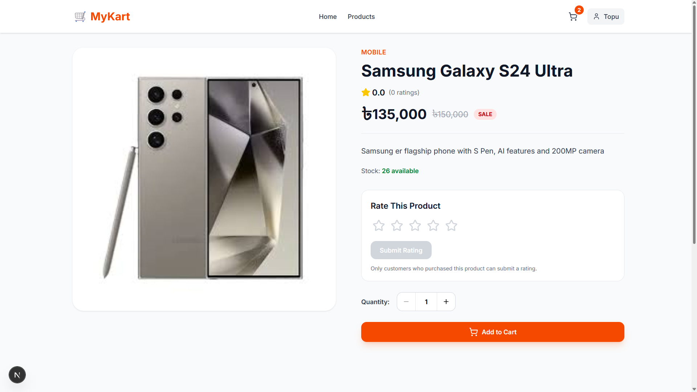
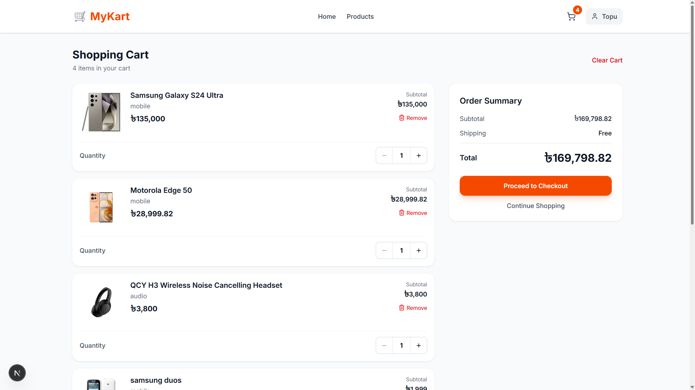
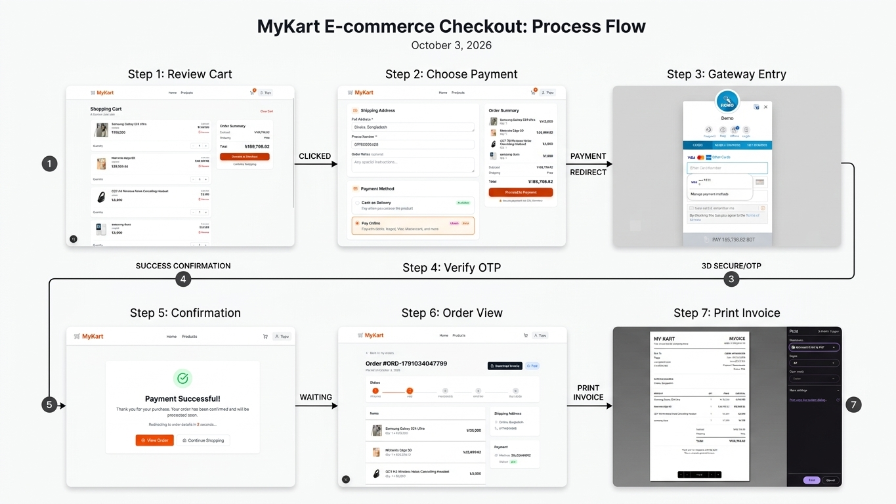
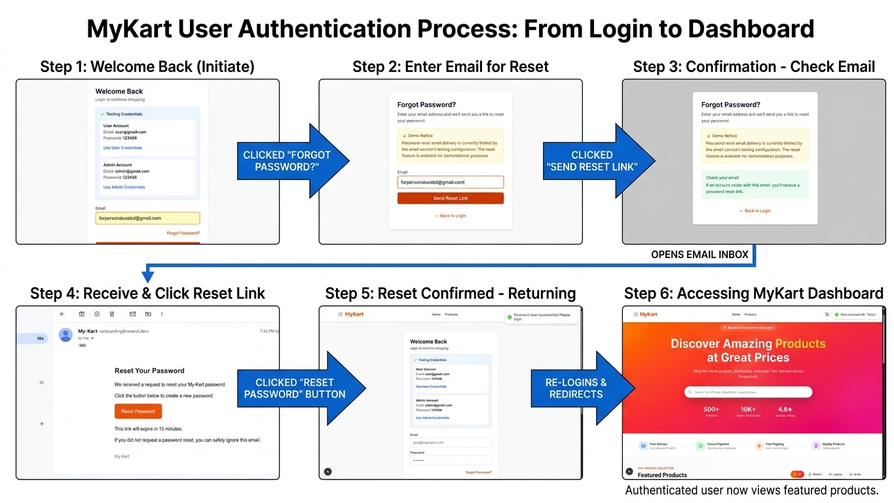
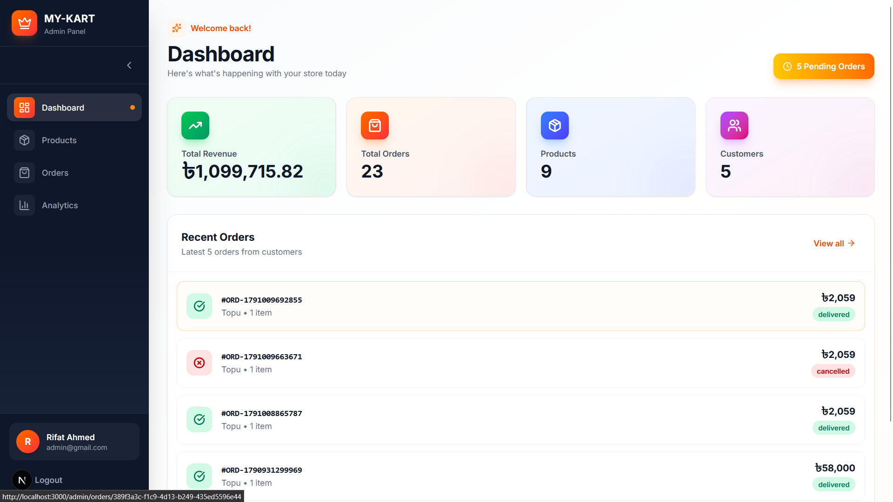
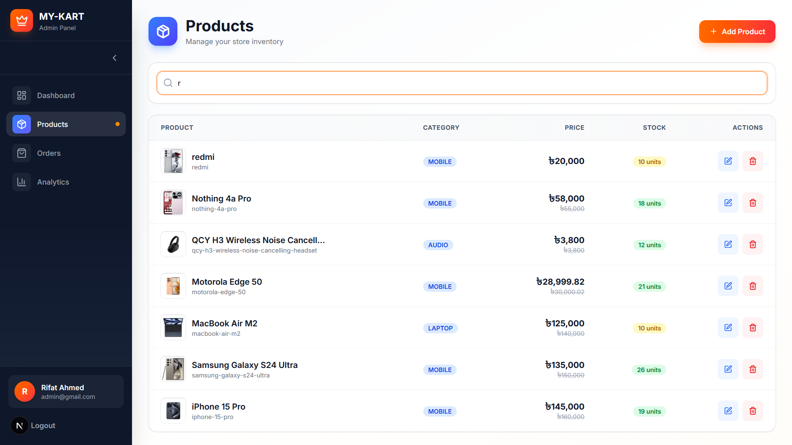
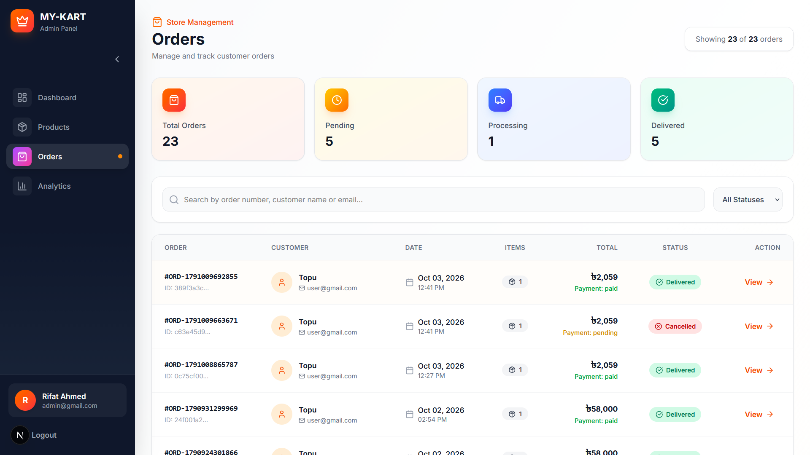
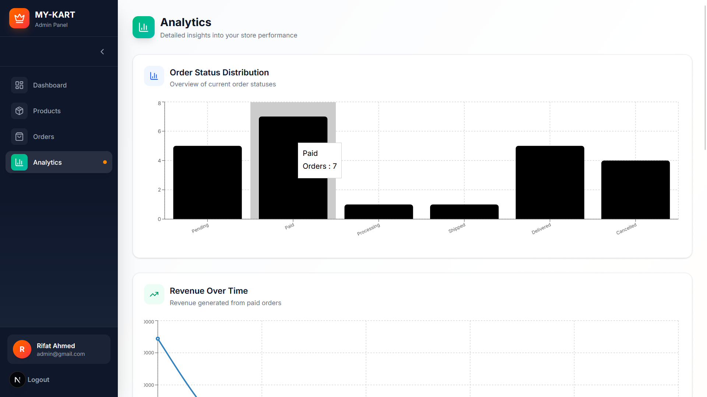
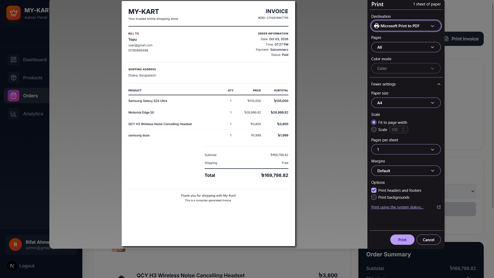

# 🛒 My-Kart

<p align="center">
  
  
  
</p>

<p align="center">
  A modern full-stack e-commerce platform built with Next.js, NestJS,
  PostgreSQL, JWT authentication, real-time communication, online payment
  integration, cloud image storage, email services, and an admin dashboard.
</p>

<p align="center">
  <a href="#-features">Features</a> •
  <a href="#-screenshots">Screenshots</a> •
  <a href="#-technology-stack">Tech Stack</a> •
  <a href="#-architecture">Architecture</a> •
  <a href="#-challenges--solutions">Challenges</a> •
  <a href="#-installation">Installation</a>
</p>

---

# 🛍️ About My-Kart

**My-Kart** is a full-stack e-commerce application developed to simulate a real-world online shopping platform.

The project covers the complete shopping lifecycle:

```text
👤 User
   ↓
🔐 Authentication
   ↓
🛍️ Browse Products
   ↓
🛒 Add to Cart
   ↓
📦 Checkout
   ↓
💳 Payment
   ↓
📋 Order Management
   ↓
⭐ Product Rating
```

Unlike a basic CRUD application, My-Kart includes business rules, role-based authorization, payment validation, real-time updates, password recovery, cloud services, and a dedicated administration system.

### Core Capabilities

* 🔐 JWT authentication
* 👥 Customer/Admin role-based authorization
* 🛍️ Product management
* 🛒 Persistent shopping cart
* 📦 Order management
* 💵 Cash on Delivery
* 💳 SSLCommerz online payment
* ⭐ Purchased-user-only product ratings
* ⚡ Real-time rating updates with Socket.IO
* 🔑 Forgot Password / Password Reset
* ☁️ Cloudinary image upload
* 📧 Resend email integration
* 📊 Admin analytics
* 🧾 Order invoice generation
* 🔄 Strict order status workflow
* 📱 Responsive user and admin interfaces
* 🚀 Production-oriented deployment architecture

---

# ✨ Features

## 👤 Customer Features

* 📝 User registration
* 🔐 User login
* 🚪 Logout
* 🪪 JWT-based authentication
* 👤 User profile
* ✏️ Edit name, email and phone
* 🔑 Forgot password
* 🔄 Reset password
* 🛍️ Browse products
* 🔎 Product details
* 🖼️ Cloud-hosted product images
* 🛒 Add products to cart
* ➕ Increase quantity
* ➖ Decrease quantity
* ❌ Remove cart items
* 🧹 Clear cart
* 💰 Subtotal calculation
* 🚚 Shipping calculation
* 📦 Checkout
* 💵 Cash on Delivery
* 💳 Online payment
* 📋 View orders
* 🔍 View order details
* ❌ Cancel eligible orders
* ⭐ Rate purchased products
* ✏️ Update existing ratings
* ⚡ Real-time rating updates

---

## 👨‍💼 Admin Features

* 📊 Admin dashboard
* 📈 Order analytics
* 💰 Revenue analytics
* 📦 Product management
* 🛍️ Order management
* 🔄 Controlled order status transitions
* 💳 Payment status monitoring
* 🧾 Order invoice
* 🔐 Admin-only protected routes
* 📊 Order status breakdown
* 📱 Responsive collapsible admin sidebar

---

# 📸 Screenshots

> Screenshots are organized to demonstrate the major customer and administration workflows of My-Kart.

## 🏠 Home & Product Discovery

### 🏠 Home Page


The homepage provides a responsive product browsing experience with product cards, categories, pricing, ratings, and shopping actions.

---

### 🛍️ Product Details



The product details page provides product information, pricing, images, ratings, availability, and cart interaction.

---

## 🛒 Shopping & Checkout

### 🛒 Shopping Cart



The cart allows customers to review selected products, update quantities, remove items, view subtotal and shipping costs, and proceed to checkout.

---

### 💳 Checkout



The checkout page collects shipping information and provides payment options including Cash on Delivery and online payment through SSLCommerz.

---

## 📦 Customer Orders

### 📋 Customer Orders


Customers can view their previous orders, payment information, order status, totals, and order dates from a dedicated order management page.

---

### 🔍 Order Details


The order details page provides a complete view of the selected order, including products, quantities, shipping information, payment method, total amount, and current status.

---

## 👤 Account

### 👤 User Profile


The profile page allows authenticated users to view and update their account information including name, email, and phone number.

---

### 🔐 Authentication



The authentication interface provides registration and login functionality with JWT-based session management.

---

## 👨‍💼 Administration

### 📊 Admin Dashboard



The admin dashboard provides a high-level overview of store activity, including order statistics, payment status, cancelled orders, and revenue information.

---

### 📦 Admin Products



Administrators can manage the product catalog, including product information, pricing, categories, images, and inventory-related data.

---

### 🛍️ Admin Orders



The admin order management interface allows administrators to inspect customer orders and manage their status according to the predefined order workflow.

---

### 📈 Admin Analytics



The analytics dashboard visualizes order and payment data using charts, helping administrators understand overall store activity.

---

### 🧾 Order Invoice



Administrators can generate a printable/downloadable order invoice containing customer, shipping, product, payment, and order information.

---

# 🧰 Technology Stack

The application is divided into four major layers:

```text
Frontend
   ↓
Backend API
   ↓
PostgreSQL Database
   ↓
External Services
```

---

## 🎨 Frontend

| Technology           | Purpose                   |
| -------------------- | ------------------------- |
| ⚛️ React             | UI development            |
| ▲ Next.js            | Frontend framework        |
| 🔷 TypeScript        | Type-safe development     |
| 🎨 Tailwind CSS      | Styling and responsive UI |
| 📡 Axios             | REST API communication    |
| 🧠 React Context API | Global state management   |
| 🍞 React Hot Toast   | User notifications        |
| ✨ Lucide React       | UI icons                  |
| ⚡ Socket.IO Client   | Real-time communication   |
| 📊 Recharts          | Admin analytics           |

### Frontend Architecture

```text
Next.js
│
├── App Router
├── React Components
├── Context API
│   ├── AuthContext
│   └── CartContext
│
├── Axios API Client
├── Tailwind CSS
├── Socket.IO Client
├── React Hot Toast
└── Recharts
```

---

# ⚙️ Backend

| Technology        | Purpose                        |
| ----------------- | ------------------------------ |
| 🐈 NestJS         | Backend framework              |
| 🔷 TypeScript     | Type-safe development          |
| 🗄️ TypeORM       | ORM / database communication   |
| 🔐 JWT            | Authentication                 |
| 🛂 Passport       | Authentication strategy        |
| 🔒 bcrypt         | Password hashing               |
| ✅ class-validator | DTO validation                 |
| ⚡ Socket.IO       | Real-time communication        |
| 🌐 REST API       | Frontend/backend communication |

### Backend Modules

```text
NestJS Backend
│
├── 🔐 Auth
├── 👤 Users
├── 🛍️ Products
├── 🛒 Cart
├── 📦 Orders
├── 💳 Payments
├── ⭐ Ratings
└── ☁️ Upload
```

---

# 🗄️ Database

## 🐘 PostgreSQL

PostgreSQL is used as the primary relational database.

### ORM

**TypeORM** manages the application's relational data model.

Main entities include:

* 👤 Users
* 🛍️ Products
* 🛒 Cart Items
* 📦 Orders
* 📦 Order Items
* ⭐ Ratings
* 🔑 Password reset data

### Main Relationships

```text
👤 User
 │
 ├── 🛒 Cart Items
 │
 ├── 📦 Orders
 │      │
 │      └── 📦 Order Items
 │
 └── ⭐ Ratings

🛍️ Product
 │
 ├── 🛒 Cart Items
 ├── 📦 Order Items
 └── ⭐ Ratings
```

---

# ☁️ External Services

## 🖼️ Cloudinary

Cloudinary is used for:

* Product image uploads
* Cloud-based image storage
* Image URL delivery

```text
Frontend
   ↓
Backend
   ↓
Cloudinary
   ↓
Image URL
   ↓
Database
```

---

## 💳 SSLCommerz

SSLCommerz is integrated for online payment processing.

### Payment Flow

```text
🛒 Checkout
     ↓
📦 Create Order
     ↓
💳 Initiate SSLCommerz
     ↓
🌐 Payment Gateway
     ↓
✅ Success Callback
     ↓
🔎 Backend Payment Validation
     ↓
💰 Order → PAID
     ↓
🧹 Cart Cleared
```

Supported callbacks:

* ✅ Success
* ❌ Fail
* 🚫 Cancel
* 🔄 IPN

The backend validates payment status before marking an order as paid.

---

## 📧 Resend

Resend is integrated for password reset email delivery.

```text
🔑 Forgot Password
       ↓
🎲 Secure Token Generated
       ↓
# Token Hash Stored
       ↓
📨 Resend
       ↓
🔗 Reset Link
       ↓
🔑 New Password
```

---

# 🔐 Authentication & Authorization

My-Kart uses JWT-based authentication with role-based authorization.

### Login Flow

```text
👤 User
  ↓
📧 Email + Password
  ↓
🔐 Backend
  ↓
🔎 Credential Verification
  ↓
🔑 JWT Access Token
  ↓
💾 Client Storage
  ↓
🛡️ Protected API Requests
```

### Supported Roles

```text
CUSTOMER
ADMIN
```

Admin-only functionality is protected on the backend rather than relying only on frontend route visibility.

---

# 🔑 Forgot Password / Password Reset

My-Kart includes a secure password recovery workflow.

### Security Flow

```text
👤 User
   ↓
🔑 Forgot Password
   ↓
📧 Email Submitted
   ↓
🎲 Secure Random Token
   ↓
# SHA-256 Token Hash
   ↓
🗄️ Store Token Hash
   ↓
⏱️ 15-Minute Expiration
   ↓
📨 Resend
   ↓
🔗 Reset Link
   ↓
🔑 New Password
   ↓
🔒 bcrypt Hash
   ↓
🗑️ Reset Token Invalidated
```

### Security Features

* 🎲 Cryptographically secure reset token
* # SHA-256 token hashing
* ⏱️ Token expiration
* 🔒 bcrypt password hashing
* 🗑️ Token invalidation after successful reset
* 🚫 No plaintext password storage
* 🚫 No plaintext password sent through email

---

# ⚠️ Password Reset Email Limitation

The password reset **logic and Resend integration are implemented**, but the current configuration uses Resend's testing sender.

Example:

```text
onboarding@resend.dev
```

This is suitable for development/testing but is not the final production email configuration for unrestricted delivery.

### Current Status

| Component                 | Status |
| ------------------------- | ------ |
| Forgot Password API       | ✅      |
| Secure Token Generation   | ✅      |
| Token Hashing             | ✅      |
| Token Expiration          | ✅      |
| Reset Link Generation     | ✅      |
| Reset Password API        | ✅      |
| bcrypt Password Hashing   | ✅      |
| Token Invalidation        | ✅      |
| Resend Integration        | ✅      |
| Production Sending Domain | ⏳      |

### Production Configuration

A production deployment should use:

1. A verified sending domain
2. Appropriate DNS records
3. A production Resend API key
4. A sender address from the verified domain

Example:

```env
FRONTEND_URL=https://your-frontend-domain.com
RESEND_API_KEY=your_resend_api_key
```

---

# 🛒 Cart System

The cart is persistent and user-specific.

Customers can:

* ➕ Add products
* ➖ Update quantity
* ❌ Remove items
* 🧹 Clear the cart
* 💰 Calculate subtotal
* 🚚 Calculate shipping
* 🔢 View total item count

### Payment-Aware Cart Clearing

The cart is cleared only after successful payment validation for online payments.

```text
🛒 Cart
  ↓
📦 Order Created
  ↓
💳 SSLCommerz
  ↓
🔎 Payment Validation
  ↓
✅ Payment Confirmed
  ↓
📦 Order → PAID
  ↓
🧹 Cart Items Removed
```

If payment fails or is cancelled, the cart remains available.

---

# 📦 Order Management

My-Kart uses a strict server-side order status workflow.

## Order Lifecycle

```text
🟡 PENDING
     │
     ├────→ 💚 PAID
     │          │
     │          ├────→ ⚙️ PROCESSING
     │          │          │
     │          │          └────→ 🚚 SHIPPED
     │          │                     │
     │          │                     └────→ ✅ DELIVERED
     │          │
     │          └────→ ❌ CANCELLED
     │
     └────→ ❌ CANCELLED
```

Invalid transitions are rejected by the backend.

Examples:

```text
❌ PENDING → SHIPPED
❌ PAID → SHIPPED
❌ DELIVERED → PROCESSING
```

This prevents invalid order states from being created through direct API requests.

---

# ⭐ Product Rating System

The rating system follows e-commerce business rules.

### Rules

* 🔐 User must be authenticated
* 🛍️ User must have purchased the product
* ❌ Cancelled orders do not qualify
* 1️⃣ One rating per user/product
* ✏️ Existing ratings can be updated
* ⭐ Rating range is 1–5
* 📊 Average rating is calculated dynamically

### Database Constraint

```ts
@Unique(['userId', 'productId'])
```

This prevents duplicate ratings for the same user and product.

---

# ⚡ Real-Time Rating Updates

Socket.IO is used to synchronize rating information in real time.

```text
👤 User A
   ↓
⭐ Submit Rating
   ↓
⚙️ NestJS
   ↓
🗄️ PostgreSQL
   ↓
⚡ Socket.IO Event
   ↓
👥 Connected Users
   ↓
⭐ Updated Rating
```

Example event:

```text
ratingUpdated
```

Example payload:

```json
{
  "productId": "product-id",
  "averageRating": 4.5,
  "totalRatings": 10
}
```

---

# 📊 Admin Analytics

The admin dashboard provides an overview of store activity.

Tracked information includes:

* 📦 Total orders
* 💳 Paid orders
* ❌ Cancelled orders
* 💰 Total revenue
* 📋 Order status breakdown

Charts are implemented using **Recharts**.

---

# 🧾 Order Invoice

Administrators can access order invoices containing:

* 🛒 My-Kart branding
* 🔢 Order number
* 👤 Customer information
* 📍 Shipping information
* 🛍️ Ordered products
* 🔢 Quantity
* 💰 Pricing
* 💳 Payment information
* 📦 Order status
* 🧮 Total amount

The invoice supports browser print/download functionality.

---

# 🧩 Challenges & Solutions

My-Kart was developed through hands-on debugging of issues across the frontend, backend, database, WebSocket, payment, and third-party integrations.

---

## 🐘 1. TypeORM + PostgreSQL Data Type Error

### Problem

While implementing password reset fields, PostgreSQL produced:

```text
DataTypeNotSupportedError:
Data type "Object" in
"User.resetPasswordTokenHash"
is not supported by "postgres"
```

### Cause

TypeORM could not correctly infer the database type for the nullable field.

### Solution

Explicit PostgreSQL-compatible types were defined:

```ts
@Column({
  type: 'varchar',
  nullable: true,
})
resetPasswordTokenHash: string | null;

@Column({
  type: 'timestamp',
  nullable: true,
})
resetPasswordExpires: Date | null;
```

### Result

✅ Password reset fields became compatible with PostgreSQL.

---

## ⚡ 2. NestJS WebSocket Version Conflict

### Problem

The project uses NestJS 11, while incompatible WebSocket package versions introduced dependency conflicts.

### Solution

NestJS 11-compatible packages were installed:

```bash
npm install @nestjs/websockets@^11 @nestjs/platform-socket.io@^11 socket.io
```

### Result

✅ Socket.IO integration works with the project's NestJS version.

---

## 🔌 3. Socket.IO Connection / Namespace Issue

### Problem

The initial Socket.IO connection produced:

```text
Invalid namespace
```

### Solution

The client connection was configured explicitly with the matching Socket.IO path and transport:

```ts
const socket = io(socketUrl, {
  path: '/socket.io',
  transports: ['websocket'],
});
```

### Result

```text
Rating socket connected
```

✅ Real-time rating communication became functional.

---

## ⭐ 4. Purchased-User-Only Rating

### Problem

A basic rating endpoint could allow an authenticated user to rate a product without actually purchasing it.

### Solution

The backend verifies:

```text
👤 User
 ↓
📦 Order Exists
 ↓
🛍️ Product Exists in Order
 ↓
🚫 Order Is Not Cancelled
 ↓
⭐ Rating Allowed
```

Business rules are enforced server-side rather than relying only on frontend controls.

---

## 1️⃣ 5. Duplicate Product Ratings

### Problem

A user should not be able to create multiple ratings for the same product.

### Solution

A database-level unique constraint was added:

```ts
@Unique(['userId', 'productId'])
```

Existing ratings can be updated instead of creating duplicates.

---

## 📦 6. Invalid Order Status Transitions

### Problem

An admin could attempt to move an order directly between unrelated states.

### Solution

A strict backend transition map was implemented:

```text
PENDING
  ↓
PAID
  ↓
PROCESSING
  ↓
SHIPPED
  ↓
DELIVERED
```

Cancellation is only allowed from eligible states.

### Result

✅ Invalid order transitions are rejected server-side.

---

## 💳 7. SSLCommerz Local Callback Problem

### Problem

During local development, the backend runs on:

```text
http://localhost:4000
```

SSLCommerz requires publicly accessible callback URLs.

### Solution

ngrok was used during local payment testing:

```bash
ngrok http 4000
```

This temporarily exposed the local backend for payment callbacks.

### Production

After deployment, the public backend URL can be used directly:

```text
https://your-backend.onrender.com/api/payments/success
```

---

## 🔎 8. SSLCommerz Payment Validation

### Problem

A browser redirect alone cannot be treated as proof of successful payment.

### Solution

The backend validates the transaction with SSLCommerz before changing the order to `PAID`.

```text
💳 Payment Callback
       ↓
🔎 SSLCommerz Validation
       ↓
✅ Valid Payment
       ↓
📦 Order → PAID
```

This keeps payment status under backend control.

---

## 🛒 9. Cart Badge After Payment

### Problem

After successful payment, the database order was updated but the frontend cart state could remain stale.

### Solution

The cart state is refreshed/cleared after successful order completion.

```text
💳 Payment
   ↓
🔎 Validation
   ↓
📦 Order → PAID
   ↓
🧹 Cart Cleared
   ↓
🛒 Cart Badge → 0
```

---

## 👤 10. `/auth/me` Missing Phone Number

### Problem

The phone number existed in the database but disappeared after refreshing the application.

### Cause

The JWT validation response did not initially include the phone field.

### Solution

The authenticated user payload was updated to include:

```ts
return {
  id: user.id,
  email: user.email,
  role: user.role,
  name: user.name,
  phone: user.phone,
};
```

### Result

✅ Profile information persists correctly after authentication refresh.

---

# 🏗️ Architecture

```text
                         🌐 User
                           │
                           ▼
                 ┌──────────────────┐
                 │     Next.js      │
                 │    Frontend      │
                 │                  │
                 │ ⚛️ React         │
                 │ 🎨 Tailwind      │
                 │ 📡 Axios         │
                 │ 🧠 Context API   │
                 │ ⚡ Socket.IO     │
                 └────────┬─────────┘
                          │
                          │ REST API
                          ▼
                 ┌──────────────────┐
                 │     NestJS       │
                 │     Backend      │
                 │                  │
                 │ 🔐 Auth          │
                 │ 👤 Users         │
                 │ 🛍️ Products      │
                 │ 🛒 Cart          │
                 │ 📦 Orders        │
                 │ 💳 Payments      │
                 │ ⭐ Ratings       │
                 │ ☁️ Upload        │
                 └────────┬─────────┘
                          │
                ┌─────────┴──────────┐
                │                    │
                ▼                    ▼
       ┌─────────────────┐   ┌─────────────────┐
       │ 🐘 PostgreSQL   │   │ ☁️ Cloudinary   │
       │                 │   │                 │
       │ Users           │   │ Product Images  │
       │ Products        │   └─────────────────┘
       │ Cart            │
       │ Orders          │
       │ Ratings         │
       └─────────────────┘

                 External Services
                         │
              ┌──────────┼──────────┐
              ▼          ▼          ▼
        💳 SSLCommerz  📧 Resend  ⚡ Socket.IO
           Payment       Email       Realtime
```

---

# 📁 Project Structure

```text
my_kart/
│
├── frontend/
│   │
│   ├── app/
│   │   ├── admin/
│   │   ├── checkout/
│   │   ├── forgot-password/
│   │   ├── login/
│   │   ├── orders/
│   │   ├── products/
│   │   ├── reset-password/
│   │   └── ...
│   │
│   ├── components/
│   ├── context/
│   │   ├── AuthContext.tsx
│   │   └── CartContext.tsx
│   ├── lib/
│   └── ...
│
├── backend/
│   │
│   └── src/
│       ├── auth/
│       ├── cart/
│       ├── orders/
│       ├── payments/
│       ├── products/
│       ├── ratings/
│       ├── users/
│       ├── upload/
│       └── ...
│
├── screenshots/
│   ├── home-page.png
│   ├── product-details.png
│   ├── shopping-cart.png
│   ├── checkout-page.png
│   ├── customer-orders.png
│   ├── customer-order-details.png
│   ├── user-profile.png
│   ├── authentication.png
│   ├── admin-dashboard.png
│   ├── admin-products.png
│   ├── admin-orders.png
│   ├── admin-analytics.png
│   └── order-invoice.png
│
└── README.md
```

---

# 🔐 Environment Variables

## 🎨 Frontend

Development:

```env
NEXT_PUBLIC_API_URL=http://localhost:4000/api
```

Production:

```env
NEXT_PUBLIC_API_URL=https://your-backend.onrender.com/api
```

---

## ⚙️ Backend

Example configuration:

```env
PORT=4000

DB_HOST=your_database_host
DB_PORT=5432
DB_USERNAME=your_database_username
DB_PASSWORD=your_database_password
DB_NAME=your_database_name

JWT_SECRET=your_jwt_secret
JWT_EXPIRES_IN=7d

FRONTEND_URL=http://localhost:3000
BACKEND_URL=http://localhost:4000

CLOUDINARY_CLOUD_NAME=your_cloud_name
CLOUDINARY_API_KEY=your_api_key
CLOUDINARY_API_SECRET=your_api_secret

SSLCOMMERZ_STORE_ID=your_store_id
SSLCOMMERZ_STORE_PASSWORD=your_store_password
SSLCOMMERZ_IS_LIVE=false

RESEND_API_KEY=your_resend_api_key
```

> 🔒 **Never commit real passwords, API keys, JWT secrets, database credentials, or other sensitive environment variables to GitHub.**

---

# 🚀 Installation

## 1. Clone the Repository

```bash
git clone <your-github-repository>
cd my-kart
```

---

## 2. Backend Setup

```bash
cd backend
npm install
```

Create the backend environment file and configure the required variables.

Start the development server:

```bash
npm run start:dev
```

Backend:

```text
http://localhost:4000
```

API:

```text
http://localhost:4000/api
```

---

## 3. Frontend Setup

Open another terminal:

```bash
cd frontend
npm install
```

Configure:

```env
NEXT_PUBLIC_API_URL=http://localhost:4000/api
```

Run:

```bash
npm run dev
```

Frontend:

```text
http://localhost:3000
```

---

# 🧪 Development Flows

## 🔐 Authentication

```text
📝 Register
   ↓
🔐 Login
   ↓
🎟️ JWT
   ↓
🔄 Refresh
   ↓
👤 Authenticated User
```

## 🛒 Cart

```text
➕ Add
 ↓
🔢 Quantity
 ↓
❌ Remove
 ↓
🧹 Clear
```

## 💵 Cash on Delivery

```text
🛒 Cart
 ↓
📦 Checkout
 ↓
💵 COD
 ↓
📦 Order Created
```

## 💳 Online Payment

```text
🛒 Cart
 ↓
📦 Create Order
 ↓
💳 SSLCommerz
 ↓
✅ Payment
 ↓
🔎 Backend Validation
 ↓
📦 PAID
 ↓
🧹 Cart Cleared
```

## ⭐ Rating

```text
📦 Purchased Product
 ↓
⭐ Submit Rating
 ↓
🔎 Backend Verification
 ↓
🗄️ Save
 ↓
⚡ Socket.IO
 ↓
👥 Real-Time UI Update
```

## 🔑 Password Reset

```text
🔑 Forgot Password
 ↓
🎲 Secure Token
 ↓
📧 Email
 ↓
🔗 Reset Link
 ↓
🔑 New Password
 ↓
✅ Login
```

---

# ⚠️ Current Limitations

## 📧 1. Resend Testing Configuration

Password reset is implemented, but production email delivery requires an appropriate verified sending domain.

---

## 💳 2. SSLCommerz Sandbox

The current project uses SSLCommerz sandbox/test credentials.

Production payment processing requires:

* Production merchant credentials
* Production payment configuration
* Production callback URLs
* `SSLCOMMERZ_IS_LIVE=true`

---

## 📊 3. Product Rating API Optimization

The current homepage retrieves ratings individually for products.

For a much larger catalog, this can be optimized through:

* Bulk rating endpoints
* Product-level rating aggregation
* Cached rating summaries

---

## 🌐 4. Local Payment Callback

During local development, ngrok may be required for SSLCommerz callbacks.

After deployment, the public Render backend URL can be used directly.

---

# 🔒 Security Considerations

Implemented:

* 🔐 JWT authentication
* 🛂 Role-based authorization
* 🔒 bcrypt password hashing
* # SHA-256 reset-token hashing
* ⏱️ Reset-token expiration
* 🛡️ Protected backend routes
* ✅ DTO validation
* 🔎 Server-side payment validation
* 1️⃣ Database-level rating uniqueness
* 🚫 Backend business-rule enforcement

Potential future hardening:

* 🚦 Rate limiting
* 🛡️ Security headers
* 🌐 Production CORS restrictions
* 🗄️ Database migrations
* 📋 Centralized logging
* 🚨 Error monitoring
* 🔄 Secret rotation
* 🧪 Automated tests
* 🔍 Input and API abuse monitoring

---

# 🚀 Deployment Architecture

The planned production architecture is:

```text
                    🌐 Users
                       │
                       ▼
               ┌─────────────────┐
               │     Vercel      │
               │    Next.js      │
               │    Frontend     │
               └────────┬────────┘
                        │
                        ▼
               ┌─────────────────┐
               │     Render      │
               │     NestJS      │
               │     Backend     │
               └───────┬─────────┘
                       │
             ┌─────────┴──────────┐
             ▼                    ▼
      ┌──────────────┐     ┌──────────────┐
      │ Neon         │     │ Cloudinary   │
      │ PostgreSQL   │     │ Images       │
      └──────────────┘     └──────────────┘

              External Services
                     │
              ┌──────┴──────┐
              ▼             ▼
        💳 SSLCommerz    📧 Resend
           Payment         Email
```

### Planned Deployment Stack

| Layer          | Platform        |
| -------------- | --------------- |
| Frontend       | Vercel          |
| Backend        | Render          |
| Database       | Neon PostgreSQL |
| Image Storage  | Cloudinary      |
| Payment        | SSLCommerz      |
| Email          | Resend          |
| Source Control | GitHub          |

---

# 📈 Future Improvements

Possible future improvements include:

* 🔎 Advanced product search
* 🏷️ Product filtering
* 📄 Pagination
* ❤️ Wishlist
* 🎟️ Coupon system
* 💬 Product reviews/comments
* 📧 Order confirmation emails
* 📦 Inventory reservation
* ⚡ Redis caching
* 📊 Bulk rating endpoint
* 🗄️ Database migrations
* 🧪 Automated testing
* 🔄 CI/CD pipeline
* 🚨 Error monitoring
* 📈 Advanced admin reporting

---

# 🎓 What This Project Demonstrates

My-Kart demonstrates practical full-stack development across multiple layers of a modern web application.

### 🎨 Frontend

* Next.js
* React
* TypeScript
* Tailwind CSS
* Context API
* Axios
* Socket.IO Client
* Recharts

### ⚙️ Backend

* NestJS
* TypeScript
* REST APIs
* JWT
* Passport
* bcrypt
* TypeORM
* class-validator
* Socket.IO

### 🗄️ Database

* PostgreSQL
* Relational data modeling
* TypeORM relationships
* Database constraints
* User/product/order relationships

### ☁️ External Services

* Cloudinary
* SSLCommerz
* Resend

### 🧠 Engineering Concepts

* Authentication
* Authorization
* Business-rule validation
* Payment validation
* Real-time communication
* State synchronization
* Error handling
* Third-party integrations
* Responsive UI
* Production deployment preparation

---

# 💡 Key Engineering Lessons

My-Kart was built not only to implement features, but also to understand how different application layers interact in a real-world system.

The project provided hands-on experience with:

```text
Frontend
   ↓
REST API
   ↓
Authentication
   ↓
Business Rules
   ↓
Database
   ↓
Third-Party Services
   ↓
Real-Time Communication
```

Several development issues required debugging across multiple layers, including PostgreSQL, TypeORM, JWT authentication, Socket.IO, payment callbacks, email delivery, cart synchronization, and responsive application behavior.

This made the project an important practical exercise in full-stack software development rather than simply a UI-focused e-commerce project.

---

# 🧑‍💻 Developer

## Md Raihan Kabir

**Full-Stack Web Developer**

### Core Technologies

```text
⚛️ React.js
▲ Next.js
🐈 NestJS
🔷 TypeScript
🐘 PostgreSQL
🗄️ TypeORM
🔐 JWT
⚡ Socket.IO
☁️ Cloudinary
💳 SSLCommerz
📧 Resend
```

**GitHub:** `raihankabir1952`

---

# 📊 Project Status

| Area                       | Status         |
| -------------------------- | -------------- |
| 🎨 Frontend                | ✅ Complete     |
| ⚙️ Backend                 | ✅ Complete     |
| 🗄️ Database Integration   | ✅ Complete     |
| 🔐 Authentication          | ✅ Complete     |
| 🛒 Cart                    | ✅ Complete     |
| 📦 Orders                  | ✅ Complete     |
| 💳 Payment Integration     | ✅ Complete     |
| ⭐ Rating System            | ✅ Complete     |
| ⚡ Real-Time Rating         | ✅ Complete     |
| 📊 Admin Analytics         | ✅ Complete     |
| 🧾 Invoice                 | ✅ Complete     |
| 🔑 Password Reset          | ✅ Complete     |
| 📱 Responsive UI           | ✅ Complete     |
| 📖 Documentation           | ✅ Complete     |
| 📸 Screenshots             | 📝 To be added |
| 📧 Production Email Domain | ⏳ Pending      |
| 🌐 Production Deployment   | ⏳ Pending      |

---

# ❤️ Built Through Real-World Debugging

My-Kart was developed as a hands-on full-stack project focused not only on implementing features, but also on understanding and solving real integration problems.

The project involved practical challenges across:

```text
🐘 PostgreSQL
🗄️ TypeORM
🔐 Authentication
⚡ WebSockets
⭐ Real-Time Ratings
💳 Payment Gateway
🌐 Callback URLs
🛒 Cart State
📧 Email Delivery
☁️ Cloud Storage
📊 Admin Analytics
📱 Responsive Design
```

The goal was to build an application where the frontend, backend, database, authentication system, payment gateway, email service, cloud storage, and real-time communication work together as one complete system.

---

<p align="center">
  <strong>🛒 My-Kart — Full-Stack E-Commerce Application</strong>
</p>

<p align="center">
  Built with ❤️ using modern web technologies.
</p>
